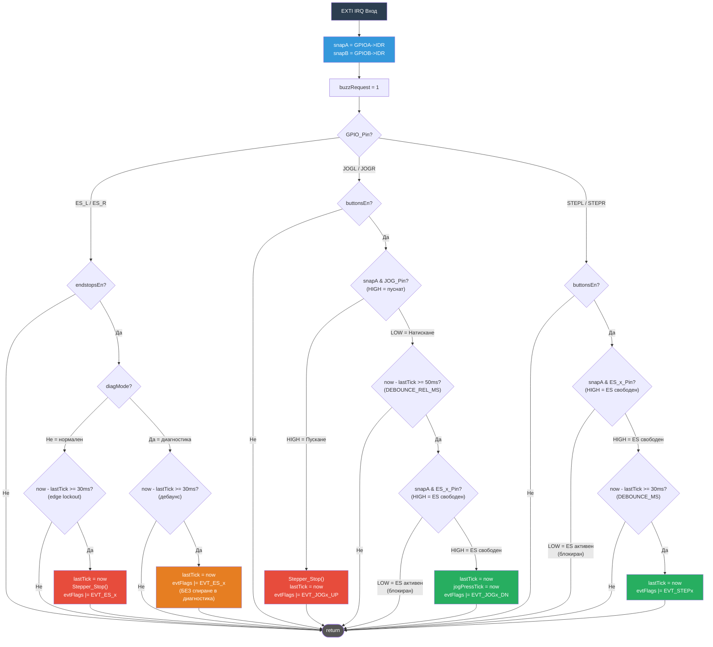

# EXTI ISR Поток

## Времеви константи

| Константа | Стойност | Използва се за |
|-----------|----------|----------------|
| `DEBOUNCE_MS` | 30 ms | Edge lockout на крайни изключватели, натискане на step бутон |
| `DEBOUNCE_REL_MS` | 50 ms | Jog дебаунс след пускане (бутоните отскачат повече при пускане) |
| `JOG_HOLD_MS` | 300 ms | Праг на задържане: кратко натискане → стъпка, дълго задържане → непрекъснато |

## Ключови дизайнерски решения

### snapA/snapB — GPIO snapshot при влизане в ISR
`GPIOA->IDR` се чете **веднъж** в началото на ISR в `snapA`.
Всички следващи проверки на пинове използват този snapshot — не live четения.
Гарантира консистентен изглед на GPIO дори ако пиновете продължат да отскачат по време на изпълнение на ISR.

### Edge lockout на крайни изключватели (30ms) в нормален режим
Крайните изключватели НЕ са "без дебаунс" — имат 30ms edge lockout.
Предотвратява множество събития за спиране от едно механично удряне (EMI / вибрации).
`Stepper_Stop()` се задейства при **първия** фронт, следващите фронтове в рамките на 30ms се игнорират.

### Jog пускане: незабавно спиране + release lockout
Пускането е безусловно: `Stepper_Stop()` се задейства незабавно.
След това `lastTick = now` нулира дебаунс прозореца на **50ms**.
Всяко bounce-натискане в рамките на 50ms след пускане се потиска.
Предотвратява фалшиви второ jog движения от механичен bounce на бутона.

### Проверка на посока на крайните изключватели в ISR (snapA)
Jog и step бутоните проверяват съответния крайен изключвател чрез `snapA` директно в ISR.
Блокирана посока се отхвърля на ISR ниво — не се поставя събитие в опашката, не е нужна обработка в main loop. Бързо и чисто.

### NVIC приоритети — безопасност на Stepper_Stop()
TIM2 (ISR за stepper импулси) и ES/JOG EXTI обработчиците са всички с **приоритет 0**.
ISR с еднакъв приоритет не могат да се прекъсват взаимно на Cortex-M4.
Следователно `Stepper_Stop()`, викан от EXTI ISR, е атомарен спрямо TIM2 ISR —
не е нужна критична секция вътре в `Stepper_Stop()`.

### buzzRequest — отложен звуков сигнал
Зумерът НЕ се превключва директно в ISR (би предизвикал race condition с MorseUpdate в main loop).
Вместо това се задава `buzzRequest = 1`, а main loop обработва звуковия сигнал когато морзето не е активно.
