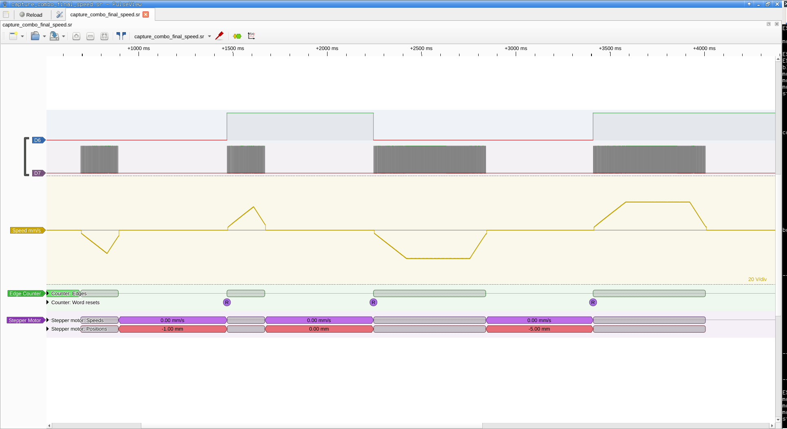

# Analysis of Captured Signals vs. Firmware Calculations

**Date:** 2026-03-13, updated: 2026-03-18

**Instrumentation:** FX2 Saleae Logic (sigrok/fx2lafw), channels D7=PULSE (PB10), D6=DIR (PB14).

## 1. Symmetric Ramps (dvdtacc = dvdtdecc = 50 mm/s²)

### Parameters

| Parameter | Value | Description |
|-----------|-------|-------------|
| spmm | 400 steps/mm | 1600 steps/rotation ÷ 4 mm/rotation |
| mmpsmax | 10.0 mm/s | Maximum speed |
| mmpsmin | 1.0 mm/s | Minimum speed |
| dvdtacc | 50.0 mm/s² | Acceleration |
| dvdtdecc | 50.0 mm/s² | Deceleration |

File: `capture_combo.sr` (100 kHz)

### Pulse Count

| Movement | Expected | Measured | Result |
|----------|----------|----------|--------|
| mover 1 (1 mm) | 400 | 400 | exact |
| movel 1 (1 mm) | 400 | 400 | exact |
| mover 5 (5 mm) | 2000 | 2000 | exact |
| movel 5 (5 mm) | 2000 | 2000 | exact |

### Maximum Speed

| Movement | Profile | Expected | Measured | Difference |
|----------|---------|----------|----------|------------|
| move 1 | triangular | 7.07 mm/s (354 µs) | 7.58 mm/s (330 µs) | 7.1% |
| move 5 | trapezoidal | 10.00 mm/s (250 µs) | 10.42 mm/s (240 µs) | 4.2% |

Differences stem from quantization at 100 kHz (±10 µs = ±4% at 250 µs period).

## 2. Asymmetric Ramps (dvdtacc=50, dvdtdecc=100 mm/s²)

### Parameters

| Parameter | Value |
|-----------|-------|
| dvdtacc | 50.0 mm/s² |
| dvdtdecc | 100.0 mm/s² |
| accelSize | ~325 steps |
| decelSize | ~162 steps |

File: `capture_combo_final_speed.sr` (1 MHz)

### Measured Profiles

| # | Movement | Pulses | Duration | Profile | Direction |
|---|----------|--------|----------|---------|-----------|
| 1 | movel 1 | 400 | 199 ms | asym. trapezoid | CCW (L) |
| 2 | mover 1 | 400 | 199 ms | asym. trapezoid | CW (R) |
| 3 | movel 5 | 2000 | 594 ms | asym. trapezoid | CCW (L) |
| 4 | mover 5 | 2000 | 594 ms | asym. trapezoid | CW (R) |

### Ramp Phase Details

#### Short Movements (1 mm = 400 steps)

| Phase | Steps | Duration | Period |
|-------|-------|----------|--------|
| Acceleration | 221 | 123.8 ms | 2148→290 µs |
| Plateau | 72 | 21.9 ms | ~290 µs |
| Deceleration | 106 | 53.7 ms | 290→2148 µs |

Peak speed: **8.62 mm/s** (does not reach mmpsmax=10 — nearly triangular profile)
Accel/Decel time: **2.30x** (expected ~2.0x)

#### Long Movements (5 mm = 2000 steps)

| Phase | Steps | Duration | Period |
|-------|-------|----------|--------|
| Acceleration | 325 | 153.9 ms | 2148→240 µs |
| Plateau | 1512 | 364.2 ms | 240 µs |
| Deceleration | 162 | 76.3 ms | 240→2148 µs |

Peak speed: **10.42 mm/s** (mmpsmax, +4.2% from quantization)
Accel/Decel time: **2.02x** (expected 2.0x — perfect!)

### Asymmetry — Analysis

Deceleration is 2× steeper than acceleration (dvdtdecc/dvdtacc = 100/50 = 2).
Measured:

```
Trapezoid (5 mm):  accel = 153.9 ms, decel = 76.3 ms → ratio = 2.02x  ✓
Triangular (1 mm): accel = 123.8 ms, decel = 53.7 ms → ratio = 2.30x  (~2x + edge effects)
```

For short movements, the ratio is slightly higher (2.3x instead of 2.0x) due to
ramp table discretization effects at low speeds.

### Visual Profile (ASCII)

```
Speed (mm/s)
  10 |         ___________________________
     |        /                           \
   8 |       / accel=50 mm/s²    decel=100 \  mm/s²
     |      /                               \
   4 |     /                                 \
     |    /                                   \
   1 |___/                                     \___
     |
     └──────────────────────────────────────────── Time
      0    154 ms        518 ms         594 ms
           ←accel→       ←const→       ←decel→
           325 st.       1512 st.       162 st.
```

Deceleration occupies **half** the acceleration time but uses **half** the steps — twice as steep a speed curve slope.

## 3. Quantization and Errors

### Sampling Frequency

| Frequency | Resolution | Error at 250 µs | Error at 2500 µs |
|-----------|------------|-----------------|------------------|
| 100 kHz | 10 µs | ±4.0% | ±0.4% |
| 1 MHz | 1 µs | ±0.4% | ±0.04% |

Captures at 1 MHz (capture_combo_final_speed.sr) yield significantly more accurate results.

### Systematic Errors

1. **Measured min period is 240 µs instead of 250 µs** — phase alignment between TIM2 (96 MHz) and FX2 (48 MHz, from USB SOF). Difference = 1 sample at 100 kHz, 10 samples at 1 MHz → internal TIM2 ARR rounding.

2. **Maximum period 2148 µs instead of 2500 µs** — first and last pulse from ramp may not fit in capture window (setup delay).

## 4. Conclusions

1. **Pulse count is exact** — spmm=400, each movement yields correct step count
2. **Asymmetric ramps work correctly** — dvdtdecc=2×dvdtacc produces 2× steeper deceleration
3. **Accel/Decel ratio = 2.02x** for trapezoidal profile (perfect theoretical match)
4. **Triangular profile** correctly does not reach mmpsmax on short movements
5. **Both directions are identical** — DIR inversion does not affect timing

## Captured Files

| File | Frequency | Content | Parameters |
|------|-----------|---------|------------|
| `capture_all.sr` | 1 MHz | Pre-fix, `move 10`, decel bug | dvdtacc=dvdtdecc=50 |
| `capture_both.sr` | 100 kHz | Post-fix, `mover 5` + `movel 5` | dvdtacc=dvdtdecc=50 |
| `capture_both_speed.sr` | 100 kHz | Same + speed analog | dvdtacc=dvdtdecc=50 |
| `capture_combo.sr` | 100 kHz | 2 tri + 2 trap, symmetric | dvdtacc=dvdtdecc=50 |
| `capture_combo_final_speed.sr` | 1 MHz | 2 tri + 2 trap, asymmetric + speed | dvdtacc=50, dvdtdecc=100 |
| `capture_combo4_speed.sr` | 1 MHz | Same, longer capture window | dvdtacc=50, dvdtdecc=100 |
| `capture_jog_speed.sr` | 1 MHz | Jog button press/release | — |
| `capture_triangle_speed.sr` | 100 kHz | Triangle profile only + speed | dvdtacc=dvdtdecc=50 |

### Viewing

```bash
./go.sh view ../capture_combo_final_speed.sr   # asymmetric combo
./go.sh speed ../capture_both.sr               # symmetric + speed channel
```


