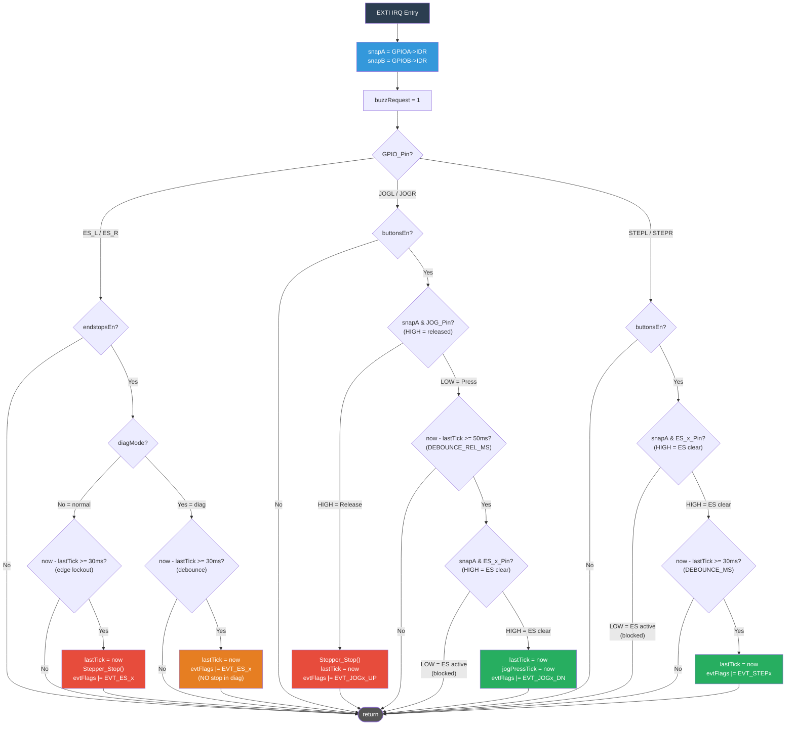

# EXTI ISR Flow

## Timing Constants

| Constant | Value | Used for |
|----------|-------|----------|
| `DEBOUNCE_MS` | 30 ms | Endstop edge lockout, step button press |
| `DEBOUNCE_REL_MS` | 50 ms | Jog press debounce after release (switches bounce more on release) |
| `JOG_HOLD_MS` | 300 ms | Hold duration threshold: short press → step, long hold → continuous |

## Key Design Decisions

### snapA/snapB — GPIO snapshot at ISR entry
`GPIOA->IDR` is read **once** at the top of the ISR into `snapA`.
All subsequent pin checks use this snapshot — not live reads.
This ensures a consistent view of GPIO state even if pins continue to bounce during ISR execution.

### Endstop edge lockout (30ms) in normal mode
Endstops are NOT "no debounce" — they have a 30ms edge lockout.
This prevents multiple stop events from a single mechanical hit (EMI / vibration).
`Stepper_Stop()` fires on the **first** edge, subsequent edges within 30ms are ignored.

### Jog release: instant stop + release lockout
Release is unconditional: `Stepper_Stop()` fires immediately.
Then `lastTick = now` resets the debounce window to **50ms**.
Any bounce-press within 50ms after release is suppressed.
This prevents spurious second jog moves from mechanical button bounce.

### Endstop direction check in ISR (snapA)
Jog and step buttons check the relevant endstop pin via `snapA` directly in the ISR.
This means a blocked direction is rejected at ISR level — no event is queued,
no main loop processing needed. Fast and clean.

### NVIC priorities — Stepper_Stop() safety
TIM2 (stepper pulse ISR) and ES/JOG EXTI handlers are all at **priority 0**.
Same-priority ISRs cannot preempt each other on Cortex-M4.
Therefore `Stepper_Stop()` called from EXTI ISR is atomic with respect to TIM2 ISR —
no critical section needed inside `Stepper_Stop()`.

### buzzRequest — deferred beep
Buzzer is NOT toggled directly in the ISR (would race with MorseUpdate in main loop).
Instead `buzzRequest = 1` is set, and the main loop handles the beep
when morse is not active.
