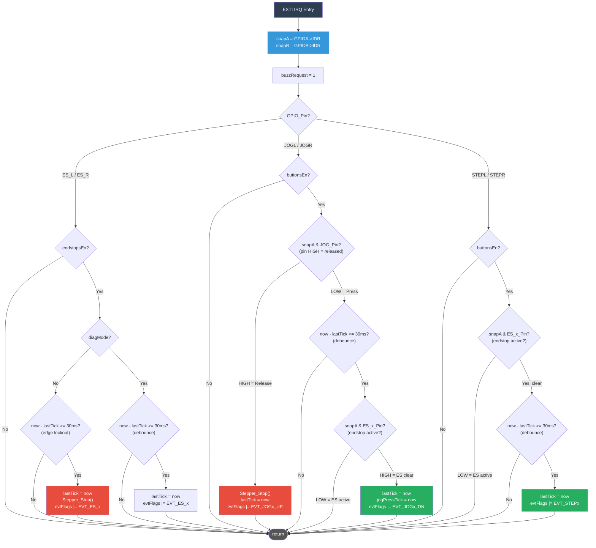

# EXTI ISR Flow

```mermaid
flowchart TD
    ENTRY[EXTI IRQ Entry] --> SNAP["snapA = GPIOA->IDR\nsnapB = GPIOB->IDR"]
    SNAP --> BEEP[buzzRequest = 1]
    BEEP --> SW{GPIO_Pin?}

    %% ---- Endstops ----
    SW -->|ES_L / ES_R| ES_EN{endstopsEn?}
    ES_EN -->|No| EXIT([return])
    ES_EN -->|Yes| ES_DIAG{diagMode?}

    ES_DIAG -->|No| ES_LOCK{"now - lastTick >= 30ms?\n(edge lockout)"}
    ES_LOCK -->|No| EXIT
    ES_LOCK -->|Yes| ES_ACT["lastTick = now\nStepper_Stop()\nevtFlags |= EVT_ES_x"]
    ES_ACT --> EXIT

    ES_DIAG -->|Yes| ES_DEB{"now - lastTick >= 30ms?\n(debounce)"}
    ES_DEB -->|No| EXIT
    ES_DEB -->|Yes| ES_DACT["lastTick = now\nevtFlags |= EVT_ES_x"]
    ES_DACT --> EXIT

    %% ---- Jog buttons ----
    SW -->|JOGL / JOGR| JOG_EN{buttonsEn?}
    JOG_EN -->|No| EXIT
    JOG_EN -->|Yes| JOG_EDGE{"snapA & JOG_Pin?\n(pin HIGH = released)"}

    JOG_EDGE -->|HIGH = Release| JOG_REL["Stepper_Stop()\nlastTick = now\nevtFlags |= EVT_JOGx_UP"]
    JOG_REL --> EXIT

    JOG_EDGE -->|LOW = Press| JOG_DEB{"now - lastTick >= 30ms?\n(debounce)"}
    JOG_DEB -->|No| EXIT
    JOG_DEB -->|Yes| JOG_ES{"snapA & ES_x_Pin?\n(endstop active?)"}
    JOG_ES -->|"LOW = ES active"| EXIT
    JOG_ES -->|"HIGH = ES clear"| JOG_ACT["lastTick = now\njogPressTick = now\nevtFlags |= EVT_JOGx_DN"]
    JOG_ACT --> EXIT

    %% ---- Step buttons ----
    SW -->|STEPL / STEPR| STEP_EN{buttonsEn?}
    STEP_EN -->|No| EXIT
    STEP_EN -->|Yes| STEP_ES{"snapA & ES_x_Pin?\n(endstop active?)"}
    STEP_ES -->|"LOW = ES active"| EXIT
    STEP_ES -->|Yes, clear| STEP_DEB{"now - lastTick >= 30ms?\n(debounce)"}
    STEP_DEB -->|No| EXIT
    STEP_DEB -->|Yes| STEP_ACT["lastTick = now\nevtFlags |= EVT_STEPx"]
    STEP_ACT --> EXIT

    %% Styling
    style ENTRY fill:#2c3e50,color:#fff
    style EXIT fill:#555,color:#fff
    style SNAP fill:#3498db,color:#fff
    style ES_ACT fill:#e74c3c,color:#fff
    style JOG_REL fill:#e74c3c,color:#fff
    style JOG_ACT fill:#27ae60,color:#fff
    style STEP_ACT fill:#27ae60,color:#fff
```
